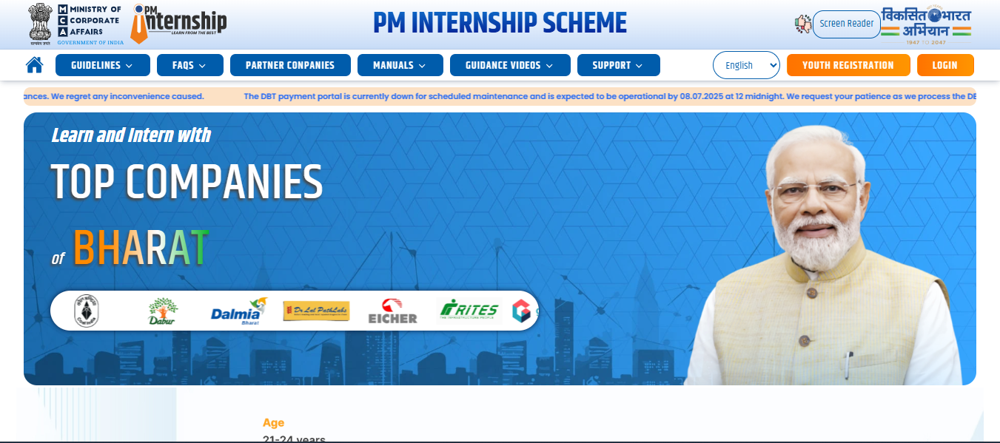
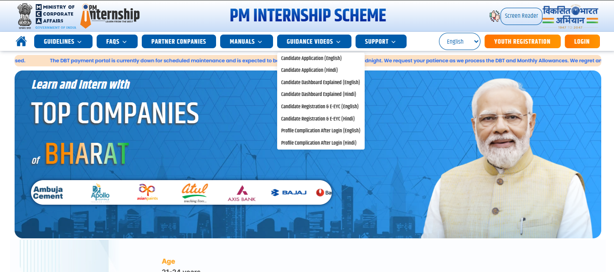
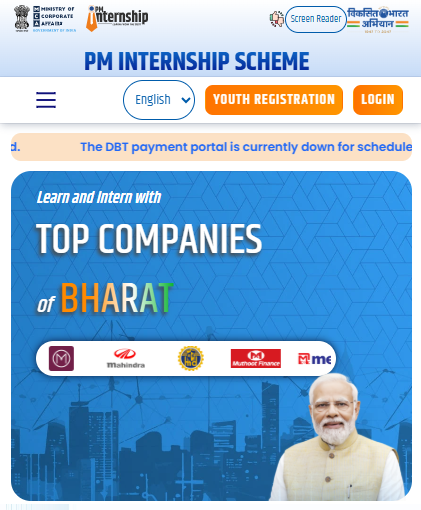

# PM Internship Website Clone

A responsive and modern clone of the official PM Internship website built using HTML, CSS, JavaScript, and Bootstrap. This project aims to replicate the look and feel of the original site for learning, practice, and showcasing front-end development skills.



## 🚀 Features

- Fully responsive design (mobile, tablet, desktop)
- Hero section with call-to-action
- About and Internship details
- Gallery Section
- Explore Opportunities Section
- Contact form (UI only)
- Smooth scrolling and modern UI interactions

## 🛠 Technologies Used

- HTML5
- CSS3
- JavaScript (Vanilla)
- Bootstrap 5
- Font Awesome Icons
- Google Fonts

## 📸 Screenshot

> Replace this image with an actual screenshot of your project.







## 📂 Folder Structure
pm-internship-clone/
├── assets/
│ ├── css/
│ ├── images/
│ └── js/
├── index.html
└── README.md


## 💡 How to Use

1. Clone this repository:
   ```bash
   git clone https://github.com/Divakar-Rajput/pm-internship-clone.git

cd pm-internship-clone


---

👉 **To Complete:**
- Take a clean screenshot of the home page of your clone.
- Save it as `screenshot.png` in the project root.
- Push the image along with your code to GitHub.

If you’d like, I can help generate a sample screenshot for preview. Would you like me to create one for you?

